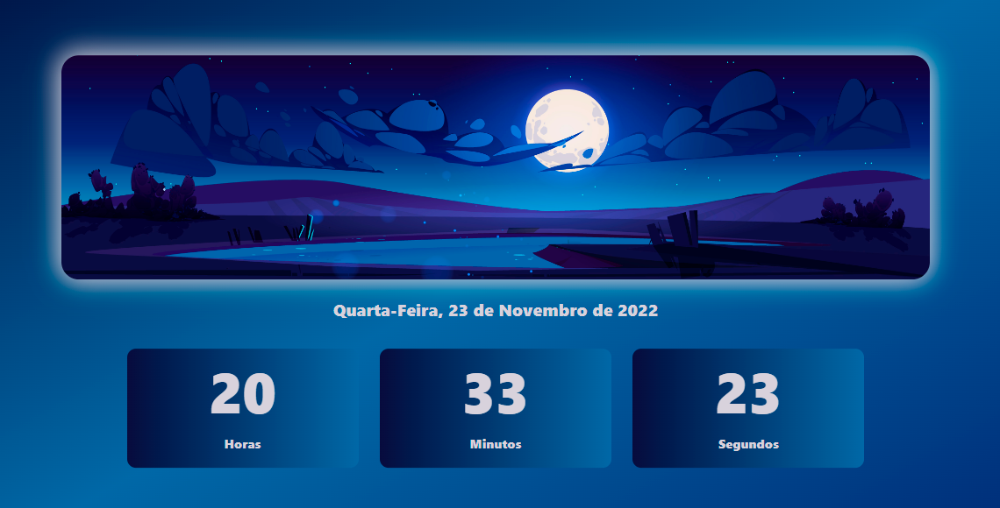

<h1 align="center">
    Projeto Relógio Digital com JavaScript
</h1>

## Sobre

O projeto consiste em fazer uma tela que mostra em tempo real(inclusive rodando os segundos) a hora exata. Resovi aprimorar e adicionar Dia da semana, Dia do mês e ano.

## DOM

Para fazer o projeto, precisei aprender a utilizar o *setInterval*, aprendi um pouco mais sobre elementos **DOM**. Mudando a *cor das letras, fundos, linear-gradients, box-shadow, IMAGEM*, com JavaScript

 

    

  

<h1 align="center">
    <a href="https://felilpz.github.io/relogio-digital/" target="_blank"> IR ATÉ O PROJETO </a>
</h1>